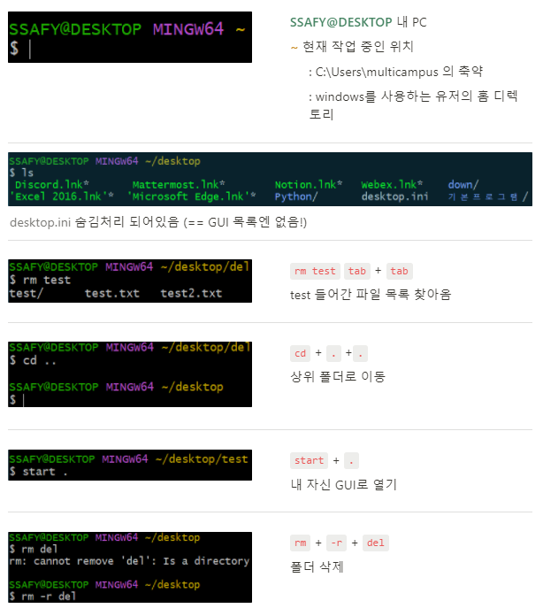

### CLI ; Command Line Interface

- **명령어를 통해** 사용자와 컴퓨터가 상호 작용
- 컴퓨터에게 명령을 내리는 방법 두 가지 → GUI, CLI
  - CLI는 GUI(; Graphic User Interface)와 똑같은 작업을 한 줄에 끝냄
  - GUI로 못하는 것 CLI로 가능 → 굳이 그래픽으로 나태날 필요가  없기 때문

### Q. Why CLI?

- 컴퓨터 리소스 절약 (명령 한 줄로 끝)

- 수 많은 서버 / 개발 시스템이 CLI 통한 조작 환경을 제공

  

### 기본 명령어

- `touch` 파일생성
- `Mkdir` 새폴더 생성
- `rm` 파일 삭제 |  `-r` (recursive)옵션을 주면 폴더 삭제 가능
- `ls` 현재 작업중인 디렉토리의 폴더 / 파일 목록 보여줌
- `cd` + `이동하고 싶은 dir` 현재 작업 중인 디렉토리 변경
- `start, open` 폴더 / 파일을 여는 명령어 (Window `start` / Mac `open`)
- `clear` 화면 지우기

------

### 절대경로  VS 상대경로

- 절대경로

  - **루트 디렉토리부터** 목적 지점까지 거치는 모든 경로
  - **C:\Users\multicampus\desktop**

- 상대경로

  - **현재 작업하고 있는 디렉토리를 기준**으로 계산된 상대적 위치를 작성한 것

  - 현재 작업하고 있는 디렉토리가 

    C:\Users

    일 때

    - 윈도우 바탕화면으로의 상대 경로는 **multicampus\desktop**

  - `./` 현재 작업하고 있는 폴더

  - `../` 현재 작업하고 있는 폴더의 부모 폴더