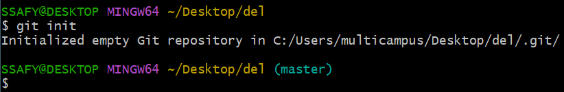
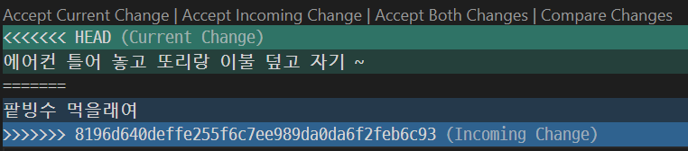
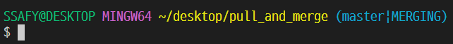
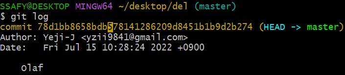

# Git

- 분산(↔중앙집중) 버전 관리 프로그램

- 물리적인 컴퓨터가 없어도 인터넷이 있으면 가능

- **특정 버전**을 히스토리로 남기기 위해 == **commit 한다**

  <commit 3가지 영역>

  - **Working Directory**: 내가 작업하고 있는 실제 디렉토리
  - **Staging Area**:  특정 버전으로 관리하고 싶은 파일이 (commit이 실제 respository에 저장되기 전) 잠시 머무는 곳 → 특정 변경된 사항들만 뽑아 남기고 싶어서
  - **Repository**: git이 commit을 저장하는 곳

------

### Commit 과정

[Working Directory] 

변경 사항 1️⃣ **untracked**   4️⃣ **modified**

`git add 파일명` or `git add .` (현재 바뀐 모든 상태 추가)

[Staging Area] 

변경 사항만 옮김 2️⃣ **staged & tracked**

```git commit -m "comment"```

[Repository] 3️⃣ **committed**


------

### GitHub - Microsoft

- Git을 기반으로 저장소 서비스 제공

- GitLab, Bitbucket etc

  

### GitHub 사용의 장점

- 개발자 직무에 대한 열정, 성실함 어필

- 공부 히스토리 기록

- 개발 능력 파악 가능

  

### Q. SSAFY는 왜 GitLab 사용? (+GitHub도 쓰긴 씀)

1. 내 소스코드가 누군가(GitHub)의 서버에 저장이 되겠네?
2. 회사 입장에서 기술 유출 걱정

→  **GitLab: 저장할 수 있는 서버를 이용자가 스스로 구축 가능한 서비스 제공**


### Repository

- 특정 디렉토리를 버전 관리하는 

  저장소

  - `git init` 명령어로 로컬 저장소 생성

  - `git.`

      디렉토리에 버전 관리에 필요한 모든 것이 들어있음

    - 윈도우에서 파일 앞에 `.` 이 붙으면 숨김 기능
    - 숨김 파일 == 건들 필요 없음 ^^



------

### Local Repo → Github Repo 연결

`git remote add` + remote repo 주소

`git push -u` + origin + master

: origin 말고 다른 것 쓸 수 있지만 관례상 origin으로 씀 *바꾸지 말기!*

`git push` **A  B**

: **A** - 어디로 push할 지, **B** - 로컬에 있는 브랜치

cf) 브랜치 : 커밋이 쌓이고 있는 하나의 큰 흐름

------

### Git Clone

`git clone` + remote repo  주소 : remote repo를 local로 복사

`git push origin master`

---

### PULL

`pull` github 변경사항 local로 가져오기

- **Conflict** : local 파일과 github이 충돌했을 때 → 내가 원하는 최종 상태로 파일 수정

  HEAD | local에 있는 내용   Incoming Change | 불러온 내용 

  

- **Merging** : Conflict가 난 것을 하나로 합치는 것
  
  

---

### 참조

`git status`

뭐가 잘못됐는지, 어떻게 해야되는지도 알려줌

`git log`

 commit 히스토리



commit 78d1bb86~ 커밋 고유 아이디 (앞의 네자리만 적어줘도  commit 구분 가능)

`git diff 커밋고유아이디네자리` : 앞을 기준으로 뒤가 어떻게 됐는지 history 보여줌 → 보기 불편해서 다른 프로그램 사용 ~

`ctrl shift +`  ` : 터미널 실행

`ctrl ,` : 설정

`code .` : 그 자리에서 vsc열기

---
**CLI로 파일 수정**

`vi 파일명`

*`i`* ; insert 입력

`esc` : 입력모드 해제

`:wq` : write quit 파일 쓰기 그만 

`:q` : 파일 수정모드 나오기