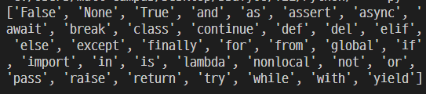

## 프로그래밍

- 특정 작업을 수행하는 일련의 명령어들의 모음
- 데이터 **저장 → 처리**하는 과정

### Python

- 유용한 라이브러리 중 최소한만을 사용해 프로그램 개발 가능
- Easy to Learn: 인간의 언어와 유사 직관적
- 인터프리터 언어 (소스 코두를 한 줄씩 변환)
- 객체지향 프로그래밍 언어

### 파이썬 개발 환경 종류

- IDE
  - 통합 개발 환경
  - VSC, Pycharm
- Jupyter Notebook
  - 한 줄 한 줄 실행 가능
  - 문법 학습시 도움
- IDLE

---

### 코드 작성법

- 문장구분 : `들여쓰기` (indentation)
  - `space bar 4번` or `tab 1번`
- 주석
  - 코드를 쉽게 이해할 수 있어 코드 수정 및 협업에 유리
  - 가독성을 저해할 정도의 무분별한 사용 자제
  - 주석 처리될 내용 앞에 `#`
  - `"""` or `'''` 로 전체를 묶어서 표현
- `alt + 화살표`
- 단어 커서 선택 + `ctrl + d` : 해당 단어 전부 선택
- `Ctrl + /`

---

## 파이썬 기초

### 변수(Variable)

: **데이터를 저장**하기 위해 사용

: 동일 변수에 다른 데이터를 언제든 할당할 수 있기 때문에 ‘변수’라 불림

1. **추상화** (변수를 사용해야 하는 이유)
   - 복잡한 단계를 단순하고 간단한게 함
   - 협업과 수정에 용이
   - 코드 가독성 증가
2. 변수의 할당

   - 연산자 `=` 를 통해 값을 할당
   - 같은 값 동시 할당 불가
   - 다른 값 동시 할당 가능 `americano, mocha = 2000, 3000`

   ***

   ```python
   # 각 변수의 값 바꿔 저장하기
   # 1. 임시 변수 활용
   x, y = 10, 20

   tmp = x
   x = y
   y = tmp
   print(x, y) # 20 10

   # 2. Pythonic!
   x, y = 10, 20
   y, x = x, y
   print(x, y) #20 10
   ```

3. 식별자 - 변수 이름 규칙

   - `영문 알파벳`, 언더스코어 `_` , `숫자`로 구성
   - **첫 글자에 숫자 올 수 없음**
   - 길이 제한 없고 **대소문자 구별**
   - 다음의 키워드는 예약어로 사용 불가
     - 기본 파이썬 문법과 겹침
     - 내장함수나 모듈 등의 이름도 사용 불가
     - 다음과 같은 예약어 사용 불가
       

4. 산술 연산자(Arithmetic Operator)
   - 덧셈 `+`
   - 뺄셈 `-`
   - 곱셈 `*`
   - 나눗셈 `/`
   - 몫 `//`
   - 거듭제곱 `**`
   - 연산자 우선순위
     - 수학의 우선순위와 동일
     - `괄호` >`곱하기, 나누기` > `더하기, 빼기`
5. 자료형(Datatype) 분류

   : 프로그래밍에서 사용할 수 있는 데이터의 종류

   - 자료형 분류
     - 수치형(Numeric Type)
       - int(정수, integer)
       - float(부동소수점, 실수, floating point number)
       - complex(복소수, complex number)
     - 문자열( String Type)
     - 불린형(Boolean Type)
     - None
   - **실수 연산시 주의할 점(부동 소수점)**

   ```python
   print(3.2 - 3.1) #0.1000000000000000000009
   print(1.2 - 1.1) #0.0999999999999999999987
   ```

   1. 컴퓨터는 2진수를 사용, 사람은 10진법을 사용
   2. 이 때 10진수 0.1은 2진수로 표현하면 0.0000101010010 ~ 무한대로 반복
   3. 따라서 10진법의 근사값만 표시

   - 해결책: `math 모듈 활용`

   ```python
   a = 3.2 - 3.1
   b = 1.2 - 1.1

   import math
   print(math.isclose(a,b))
   ```
